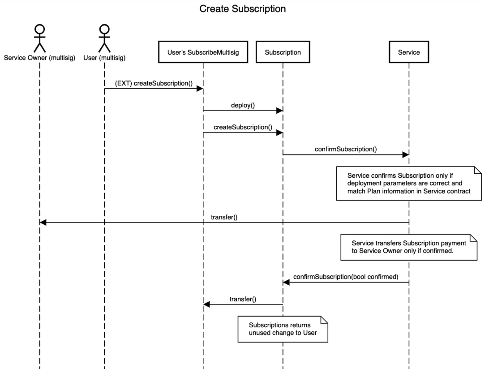
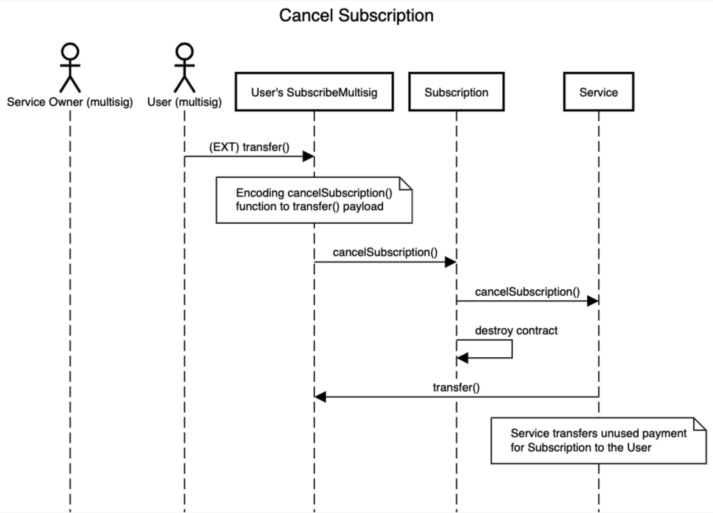
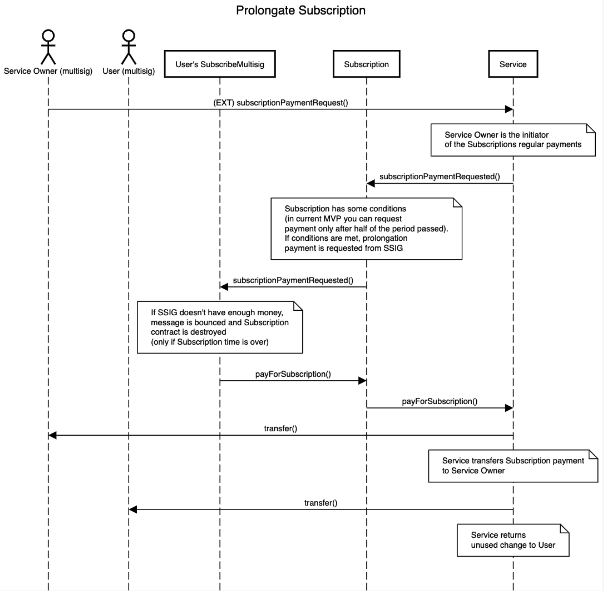

# Recurring Payments ('Subscriptions') smart contract system

`Author`: Anton Platonov

`Telegram`: @SuperArmor

`Wallet Address`: 0:cba39007bdb0f025aac0609b25e96a7d2153f06d22fa47b5f6c26cf756b8b2d6

`[devnet] Service 1 address`: 0:211a6dcd322f9e6f97955d53da7e8a8e85c7425df6635c0e26f002ad641b59e9

`[devnet] Service 2 address`: 0:0b98484bede2205a8ba7d18fac427713270a2f8b2ebb690268110e9b0ff05162

`[devnet] Service 3 address`: 0:f37da5bbcc924466a5ba9d72e493b888effd0e58f4e73dd264818165deb14f3d

`[devnet] DeBot address`: 0:ffa7df049e4e25a4a12c84aa120e1776e22347ab30ee3817728f717d5782199c

`Code:` https://github.com/SolderingArmor/freeton-subscriptions

`Video:` https://youtu.be/P7Na7a_nHdI

## Description

Decentralized problems require decentralized solutions.

At first an idea about someone charging you a fee automatically in a decentralized blockchain sounds crazy. System where control over user's assets and their spending is first and utmost priority shoudn't allow someone spend these assets for you. It is yet another field where UX, ease of use and convenience battle with security and safety. To please both worlds a set of rules shoud be created. 

This solution is the set of rules that allows third parties spend user assets automatically, but using a strict set of rules to keep user's assets safe and secure.

## Entities

`Subscription` - Contract that represents user's subscription status. Connects `Services` and `Users` (aka `Multisigs`) with each other and acts like escrow between them. `Users` manage their subscriptions, start and stop using this contract. `Services` use this contract as a trusted proxy when recurring payment is required. 

`Service` - Custom contract (can be heavily modified) that represents a service that is used by `Users`. Can have multiple tiers - subscruption types with different conditions. `Service` Owner is responsible for Subscription renewal transaction initiation.

`SubscribeMultisig` - Custom `SafeMultisig` that supports `Subscription` contract to be used as an escrow.

At any given moment of time all entities (except `Service` owner's wallet and user's wallet) don't keep any money except the minimal reserved one (0.01 TON in this MVP).

## MVP limitations

MVP is not a release version, it has some experimental features, some corners are cut and some non-implemented design ideas exist.

Before it becomes a release it needs to run several rounds of testing.

Here are the limitations of current MVP version:

* `DeBot` has 3 `Services` hardcoded (should build the list dynamically in release version).
* `SubscribeMultisig` Subscriptions work for only single custodian. For multiple custodians `SubmitSubscription` and `ConfirmSubscription` should be implemented.
* Using TIP-3 tokens is included in design but was not implemented in MVP because straightforward approach has security problems (implementing both `No staking` and `Keep user's assets secure` requirements). 

## Workflow







## Running the tests

Requirements:

`Linux/Mac (bash)`

`python` - `3.6+`

`ton-client-py` - `1.20.0+`

`TON OS SE`

Running test scripts:

```
cd tests
./run_tests.py http://127.0.0.1
```

Please use the address with your `TON OS SE` is installed.

## Contest requirements

| Requirement | Comment |
|---|---|
| To develop a Recurring Subscription smart contract system using either Solidity or C++ languages | Solidity. Fully compliant. |
| Distributed smart contracts are always preferable | Every `Subscription` is a separate contract. Fully compliant. |
| Should allow product owners (service providers) to deploy a smart contract on FreeTON with parameters for a subscription including destination address, TIP-3 token address (if necessary), token amount, and period of recurrence. | See `Service.sol` contract. Fully compliant. |
| The subscriber should be able to control subscription status (starting, stopping, pausing, etc) | See `Subscription.sol` contract. Fully compliant. |
| Product owners should be able supply a link to the subscriber that is presented with the terms of the subscription to sign an transaction that is replayed on the defined period | DeBot subscription initiation is present, can be extended to web dapp if required. Fully compliant. |
| Should support the ability to subscribe with TON Crystal tokens as well as any other TIP-3 Token | TON Crystal is fully supported, TIP-3 will require minimal additions. Partially compliant. |
| Should include DeBots for all system user interfaces | See `SubscriptionDebot.sol` contract. Fully compliant. |
| Some kind of validation (for off-chain services) and verification (on-chain services) should be implemented | See `Subscription.sol` contract (regular and responsible getters). Fully compliant. |
| A system should be deployed and tested on any test network(net.ton.dev, fld.ton.dev) and Jury should be able to access it for testing | Addresses are at the beginning of the document. Fully compliant. |
| Solution should be committed to the Free TON community repo | Fully compliant. |
| Should include auto-tests designed as a smart contract or a script to test scenarios | `ton-client-py` Python SDK wrapper + TON OS SE. Fully compliant. |
| A solution should have a Free Software license | CC0. Fully compliant. |
| Your repo should include README with introduction and usage manual and deploy instructions | Welcome to this document. Fully compliant. |
| **Safety first**. If the architecture is not able to keep user funds secure, it is a non-starter | Fully compliant. |
| **Minimize UX Complexity**. A user should have closest as possible experience to legacy web but with all blockchain benefits | Hope it looks almost the same. Fully compliant. |
| **Opt-Out First**. A user should not need to perform actions on an on-going basis. It should be a “set it and forget it” experience. A subscriber performs one transaction to set the subscription in motion and transactions should happen `automatically` between the parties | Fully compliant. |
| **Minimizes Gas Use**. The smart contract(s) should be as efficient of a consumer of on-chain resources as possible | Brevity and efficiency are top priorities. Fully compliant. |
| **No Staking**. A user should not have to stake funds. i.e. lock 1200 TON for a subscription that pays out 100 TON per month. | No staking used. Fully compliant. |
| **Bonus: Extensibility**. It’d be great if the smart contract could be extended to any recurring action (not just TIP3/TON Crystal transfers) | Contracts were designed with extensibility in mind. Partially compliant (only because no extensions provided with this subscription). |
| **Bonus: Notifications**. It’d be great if the smart contract could notify users regarding payment date or insufficient balance on the wallet, send bills (e.q. with TON Surf) | Doesn't comply with **Minimizes Gas Use** requirement. |